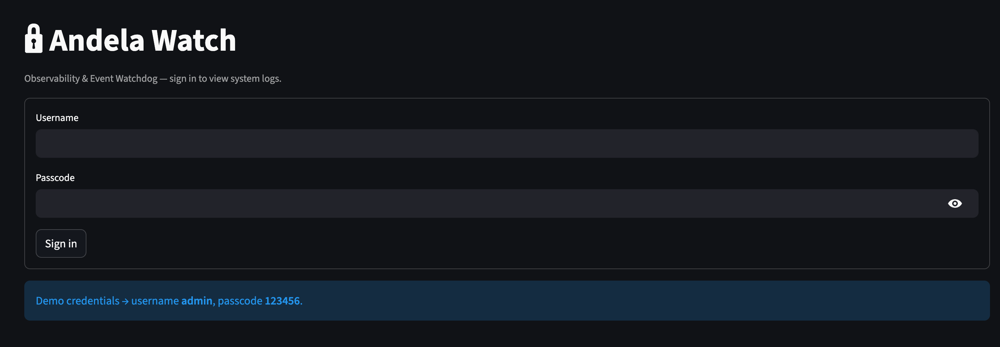
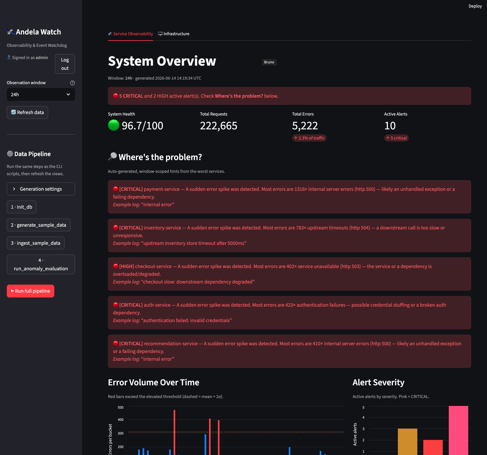
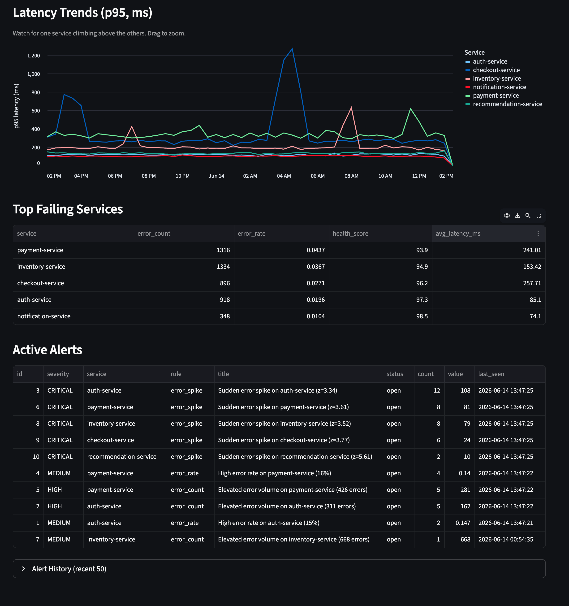
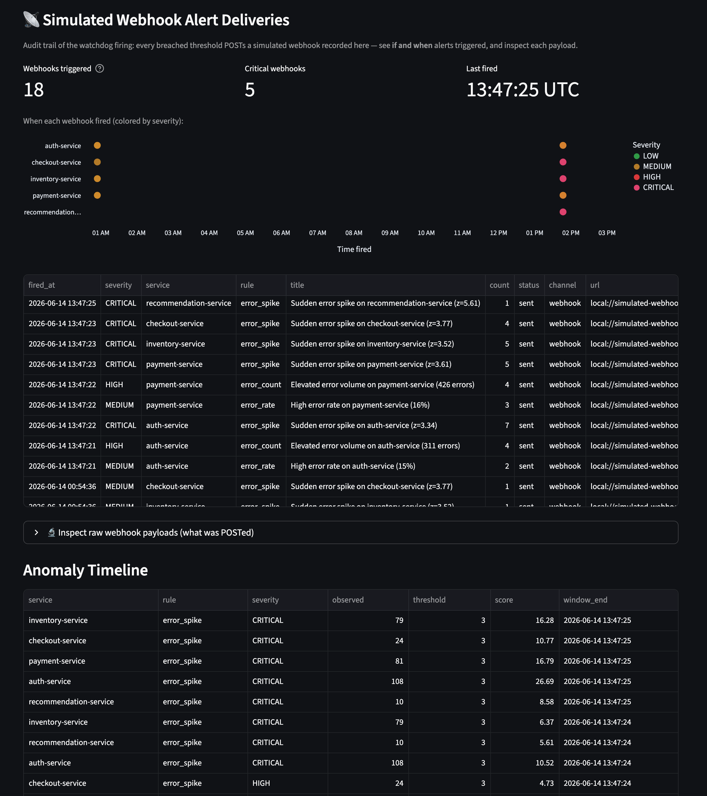
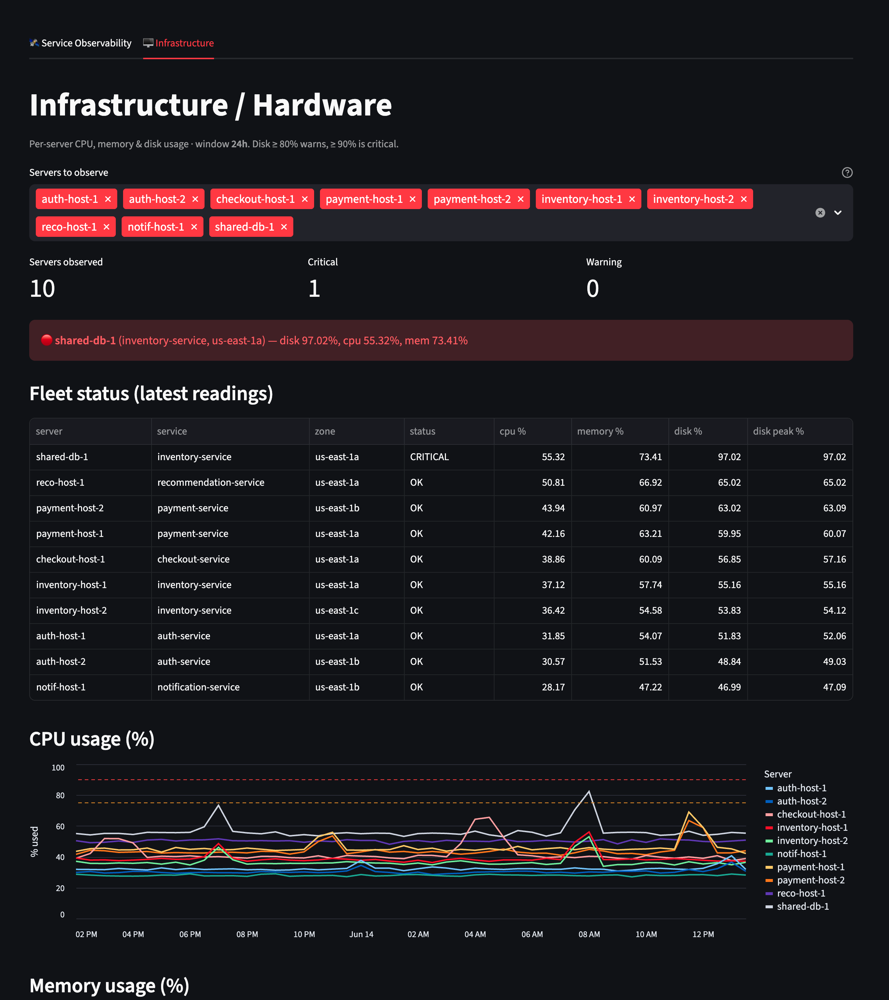
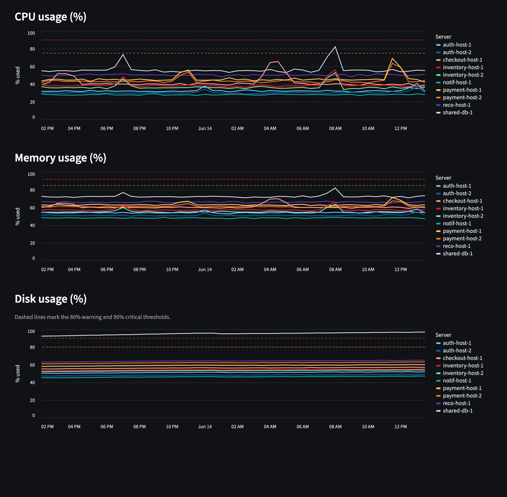
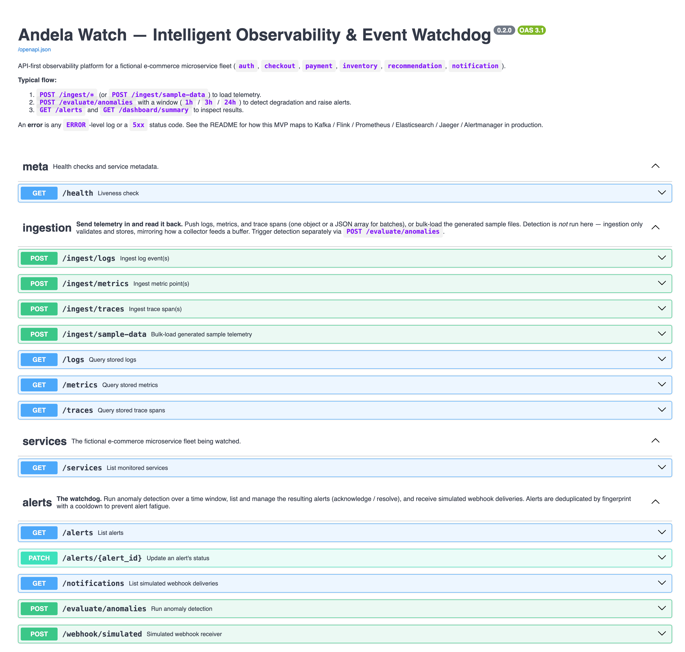
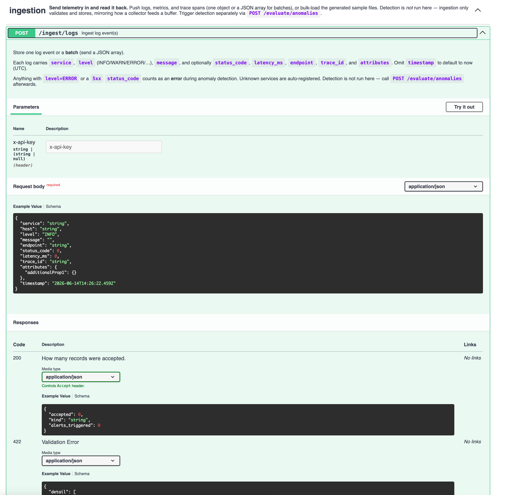
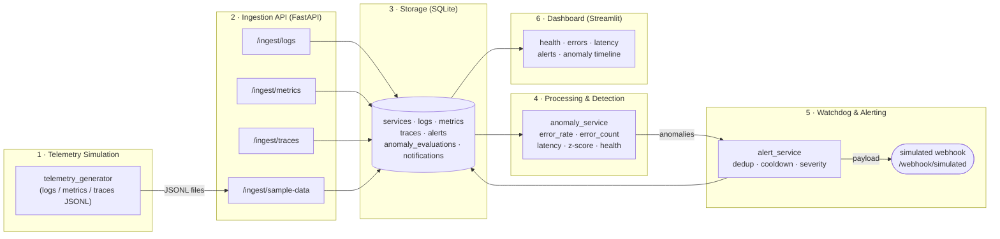
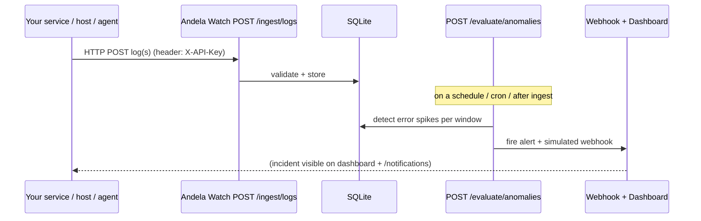

# Andela Watch — Intelligent Observability & Event Watchdog

A local, **API-first** observability & event-watchdog platform for a distributed
microservice fleet. Your services (or the bundled simulator) **send logs/metrics/
traces over HTTP**; Andela Watch **ingests** them, **detects** health degradation
and error spikes with practical statistical rules, **raises deduplicated alerts**
with a simulated webhook, and visualizes everything in a **login-protected
Streamlit dashboard** with Grafana-style observation windows (**30m → 7d**) and a
dedicated **hardware/infrastructure** view (per-server CPU / memory / disk).

It is intentionally built as a *realistic local MVP that mirrors an enterprise
architecture*. We do **not** deploy Kafka, Flink, Prometheus, Elasticsearch, or
Jaeger — but the code and docs map every component to its production counterpart.
See [docs/architecture.md](docs/architecture.md) and
[docs/production_evolution.md](docs/production_evolution.md).

---

## Table of contents
- [📸 System tour](#-system-tour)
- [Project overview](#project-overview)
- [Architecture](#architecture)
- [Enterprise mapping](#how-the-mvp-maps-to-an-enterprise-architecture)
- [Quickstart](#quickstart)
- [**Usage — send your logs to Andela Watch**](#usage--send-your-logs-to-andela-watch)
- [Security & access control](#security--access-control)
- [Running the API](#running-the-api)
- [Running the dashboard](#running-the-dashboard)
- [Generating & ingesting telemetry](#generating--ingesting-sample-telemetry)
- [Anomaly detection rules](#anomaly-detection-rules)
- [The built-in anomaly scenarios](#the-built-in-anomaly-scenarios)
- [API reference](#api-reference)
- [Database schema](#database-schema)
- [Tests](#tests)
- [Limitations & future improvements](#limitations--future-improvements)

---

## 📸 System tour

A guided walkthrough of Andela Watch — from sign-in, through service & hardware
observability, to the alerting audit trail and the API that powers it all.

### 1 · 🔒 Secure login
Access to the system logs is gated by a sign-in page (demo credentials
**admin / 123456**, overridable via env vars). A *Log out* control lives in the
sidebar.



### 2 · 🛰️ Service Observability — System Overview
The landing dashboard: a **status banner** (here, 5 CRITICAL / 2 HIGH alerts),
**KPI cards** (system health, requests, errors, active alerts), and a
**"Where's the problem?"** panel that turns raw telemetry into plain-English root
causes per service. The sidebar carries the **Grafana-style window selector** and
**one-click data-pipeline** controls (init → generate → ingest → evaluate).



### 3 · 📈 Latency trends, top failing services & active alerts
Interactive **p95 latency** per service (drag to zoom), a **Top Failing Services**
ranking, and the live **Active Alerts** table — severity, rule, count, and when
each was last seen.



### 4 · 📡 Simulated webhook alert deliveries
The watchdog's firing **audit trail**: how many webhooks triggered, how many were
CRITICAL, and **when** each fired (severity-colored timeline) — plus the delivery
log, a raw-payload inspector, and the anomaly timeline. This answers *"did the
system alert, and when?"*



### 5 · 🖥️ Infrastructure — fleet overview
The **Infrastructure tab**: select which servers to observe, see fleet KPIs and a
**status table** (OK / WARN / CRITICAL). Here `shared-db-1` is flagged **CRITICAL**
at ~97% disk — a hardware problem surfaced independently of application errors.



### 6 · 📊 Hardware time-series (CPU / memory / disk)
Per-server **CPU, memory, and disk** usage over the selected window, with dashed
**80% warning** and **90% critical** reference lines — note `shared-db-1` riding
the top of the disk chart.



### 7 · 🧩 API — auto-generated OpenAPI docs
Everything the dashboard does is an HTTP endpoint. The API is **self-documenting**
at `/docs`, grouped by concern (meta · ingestion · services · alerts · dashboard ·
infrastructure) with a "typical flow" up top.



### 8 · 🔑 API — sending logs with `X-API-Key`
The integration entry point: `POST /ingest/logs` accepts one log or a batch,
authenticated with the **`X-API-Key`** header. The docs show the exact request
schema and responses — this is how your servers (or an AI agent) **close the
ingestion loop**.



---

## Project overview

The system models six microservices:

`auth-service` · `checkout-service` · `payment-service` · `inventory-service` ·
`recommendation-service` · `notification-service`

The telemetry generator emits **≥10,000 log events/hour** plus per-minute metrics
and trace-like spans, blending normal behavior with **deterministic anomaly
periods**. The detection engine then surfaces payment failures, checkout latency
spikes, auth failure bursts, and inventory timeouts.

## Architecture



Layered, modular code under [app/](app/):

```
app/
  api/        FastAPI routers (health, ingestion, alerts, services, dashboard)
  core/       config, database engine/session, security
  models/     SQLAlchemy ORM models + Pydantic schemas
  services/   telemetry_generator, ingestion, anomaly, alert, dashboard
  utils/      time-window helpers
```

## How the MVP maps to an enterprise architecture

| MVP component (this repo) | Production component |
|---|---|
| `telemetry_generator.py` | OpenTelemetry SDKs / Collectors in each service |
| FastAPI `/ingest/*` | OTel Collector + **Kafka** ingestion buffer |
| `anomaly_service.py` (batch on SQLite) | **Flink** / stream processor on the Kafka topic |
| `logs` table | **Elasticsearch / OpenSearch** |
| `metrics` table | **Prometheus / TimescaleDB** |
| `traces` table | **Jaeger / Tempo** |
| `alert_service.py` (dedup + cooldown) | **Alertmanager / PagerDuty** (grouping, inhibition, repeat-interval) |
| `/webhook/simulated` | Real Slack / PagerDuty / webhook routing |
| Streamlit dashboard | **Grafana** |

Full detail in [docs/production_evolution.md](docs/production_evolution.md).

---

## Quickstart

```bash
python -m pip install -r requirements.txt

# One-shot demo: init DB -> generate 24h telemetry -> ingest -> detect
python scripts/init_db.py
python scripts/generate_sample_data.py        # 24h @ 10k logs/hour (~240k logs)
python scripts/ingest_sample_data.py
python scripts/run_anomaly_evaluation.py      # evaluates 1h, 3h, 24h

# Then, in two terminals:
uvicorn app.main:app --reload                 # API  -> http://127.0.0.1:8000/docs
streamlit run dashboard/streamlit_app.py      # UI   -> http://localhost:8501
```

> The generator anchors data to "now", so the dashboard always shows fresh data
> inside the selected window. Re-run `generate` + `ingest` + `evaluate` to refresh.

### 📦 Shared data & assets (Google Drive)

The `data/` subfolders (generated telemetry under `data/sample_telemetry/` and the
SQLite database `data/observability.db`) are **not committed to git** — they are
large and machine-generated. You can either **regenerate them locally** with the
pipeline above, or **download the shared dataset** from Google Drive:

**📂 [Andela Watch — shared data & assets (Google Drive)](https://drive.google.com/drive/folders/1ZUA6MCVR5aRBWQmhLEv9IHWlo5gJ1Kzt?usp=sharing)**

To use the downloaded files, place them under `data/` so the layout is:

```
data/
├── observability.db
└── sample_telemetry/
    ├── logs.jsonl
    ├── metrics.jsonl
    └── traces.jsonl
```

---

## Usage — send your logs to Andela Watch

The telemetry generator is only for the **demo**. In real use, **your own
services are the source of truth**: each app/host ships its logs (and optionally
metrics and traces) to Andela Watch's HTTP API, which ingests, stores, and
analyzes them. This section closes the full loop: **how a server, or an AI agent,
configures itself to push log data into the observer.**

### How it works (end-to-end)



1. Your service emits a log line (e.g. an HTTP 500).
2. It **POSTs that log** to `POST /ingest/logs` (with the `X-API-Key` header if
   the server has a key configured).
3. Andela Watch validates and stores it.
4. `POST /evaluate/anomalies` (run on a schedule, or after a batch) detects error
   spikes and **fires a webhook alert**.
5. The incident appears in the dashboard and in `GET /notifications`.

### Step 1 — point your client at the API

Base URL is wherever the API runs, e.g. `http://localhost:8000` (or your host).
The interactive contract is always at `http://<host>:8000/docs`.

### Step 2 — (recommended) turn on the API key

By default ingestion is **open** (frictionless for local dev). To require
authentication, set the key on the **server** before starting it:

```bash
export WATCHDOG_API_KEY="choose-a-long-random-secret"
uvicorn app.main:app --host 0.0.0.0 --port 8000
```

Once set, **every write/ingest request must send the same value in the
`X-API-Key` HTTP header**. Requests without it (or with the wrong value) get
`401 Unauthorized`. Read-only endpoints stay open.

| Requires `X-API-Key` (when key is set) | Always open (read-only) |
|---|---|
| `POST /ingest/logs`, `/ingest/metrics`, `/ingest/traces`, `/ingest/sample-data` · `POST /evaluate/anomalies` · `PATCH /alerts/{id}` | `GET /health`, `/services`, `/hosts`, `/logs`, `/metrics`, `/traces`, `/alerts`, `/notifications`, `/dashboard/summary`, `/infrastructure/summary` |

### Step 3 — the log payload

`POST /ingest/logs` accepts **one object or an array** (batch). Fields:

| Field | Type | Required | Notes |
|---|---|---|---|
| `service` | string | ✅ | Logical service name, e.g. `payment-service` |
| `host` | string | – | Server the log came from, e.g. `payment-host-1` |
| `level` | string | – | `INFO` / `WARN` / `ERROR` / … (default `INFO`) |
| `message` | string | – | The log message |
| `status_code` | int | – | HTTP status, e.g. `500` |
| `latency_ms` | float | – | Request latency in ms |
| `endpoint` | string | – | Route, e.g. `/charge` |
| `trace_id` | string | – | Correlate with traces |
| `attributes` | object | – | Any extra key/values |
| `timestamp` | ISO-8601 | – | Defaults to server `now` (UTC) |

> **What counts as an error:** a log with `level == "ERROR"` **or** a `5xx`
> `status_code`. These drive the spike/rate/count detection — so make sure failing
> requests are logged at `ERROR` and/or carry their `5xx` status.

### Step 4 — send a log with `curl` (note the `X-API-Key` header)

```bash
# single log
curl -X POST http://localhost:8000/ingest/logs \
  -H 'Content-Type: application/json' \
  -H 'X-API-Key: choose-a-long-random-secret' \
  -d '{
        "service": "payment-service",
        "host": "payment-host-1",
        "level": "ERROR",
        "status_code": 500,
        "endpoint": "/charge",
        "message": "payment gateway returned 500",
        "latency_ms": 820
      }'

# batch (recommended for throughput) — send a JSON array
curl -X POST http://localhost:8000/ingest/logs \
  -H 'Content-Type: application/json' \
  -H 'X-API-Key: choose-a-long-random-secret' \
  -d '[{"service":"auth-service","level":"ERROR","status_code":401,"message":"login failed"},
       {"service":"auth-service","level":"INFO","status_code":200,"message":"login ok"}]'
```

A successful call returns `{"accepted": <n>, "kind": "logs", "alerts_triggered": 0}`.

### Step 5 — integrate from your server (Python)

A tiny reusable client that always attaches the key:

```python
import requests

WATCH_URL = "http://localhost:8000"
API_KEY   = "choose-a-long-random-secret"   # omit header if server has no key

session = requests.Session()
session.headers.update({"Content-Type": "application/json", "X-API-Key": API_KEY})

def send_logs(logs: list[dict]):
    r = session.post(f"{WATCH_URL}/ingest/logs", json=logs, timeout=5)
    r.raise_for_status()
    return r.json()
```

A **drop-in `logging` handler** so your app ships logs automatically:

```python
import logging, requests

class AndelaWatchHandler(logging.Handler):
    """Forward Python log records to Andela Watch. Never raises into the app."""
    def __init__(self, service, url="http://localhost:8000", api_key=None, host=None):
        super().__init__()
        self.service, self.url, self.host = service, url, host
        self.session = requests.Session()
        if api_key:
            self.session.headers["X-API-Key"] = api_key   # <-- key travels with every log

    def emit(self, record):
        try:
            self.session.post(f"{self.url}/ingest/logs", timeout=2, json={
                "service": self.service,
                "host": self.host,
                "level": record.levelname,
                "message": record.getMessage(),
                "status_code": getattr(record, "status_code", None),
                "latency_ms":  getattr(record, "latency_ms", None),
                "endpoint":    getattr(record, "endpoint", None),
            })
        except Exception:
            pass  # telemetry must never break the application

log = logging.getLogger("payment-service")
log.addHandler(AndelaWatchHandler("payment-service",
                                  api_key="choose-a-long-random-secret",
                                  host="payment-host-1"))
log.error("payment gateway returned 500",
          extra={"status_code": 500, "endpoint": "/charge"})
```

> **Production tip:** buffer and send on a background thread/queue so logging never
> blocks request handling, and prefer **batch** posts. This is exactly the job an
> OpenTelemetry Collector does in the enterprise architecture (see
> [docs/production_evolution.md](docs/production_evolution.md)).

### Step 6 — for an AI agent (machine-readable contract)

```
POST {BASE_URL}/ingest/logs
Headers:  Content-Type: application/json
          X-API-Key: {key}        # required ONLY if the server set WATCHDOG_API_KEY
Body:     a JSON object OR array of objects:
          { service:str(required), host:str?, level:str?, message:str?,
            status_code:int?, latency_ms:float?, endpoint:str?, trace_id:str?,
            attributes:object?, timestamp:ISO-8601? }
Errors:   401 -> missing/invalid X-API-Key ;  422 -> invalid body (e.g. no service)
OK:       200 -> { "accepted": N, "kind": "logs", "alerts_triggered": 0 }
Detect:   then POST {BASE_URL}/evaluate/anomalies  body { "window": "1h" }
Verify:   GET {BASE_URL}/logs?service=...   GET {BASE_URL}/alerts   GET {BASE_URL}/notifications
Semantics: a record is an "error" if level=="ERROR" or status_code is 5xx.
```

### Sending metrics & hardware telemetry

Same pattern, different endpoint. Service metrics and **per-host hardware**
metrics both go to `POST /ingest/metrics` (host metrics simply include a `host`):

```bash
# host CPU/memory/disk (drives the Infrastructure tab)
curl -X POST http://localhost:8000/ingest/metrics \
  -H 'Content-Type: application/json' -H 'X-API-Key: choose-a-long-random-secret' \
  -d '[{"service":"payment-service","host":"payment-host-1","name":"cpu_usage","value":91.5,"unit":"%"},
       {"service":"payment-service","host":"payment-host-1","name":"disk_usage","value":88.0,"unit":"%"}]'
```

Recognized hardware metric names: `cpu_usage`, `memory_usage`, `disk_usage`.

### Step 7 — run detection & confirm

```bash
curl -X POST http://localhost:8000/evaluate/anomalies \
  -H 'Content-Type: application/json' -H 'X-API-Key: choose-a-long-random-secret' \
  -d '{"window":"1h"}'

curl "http://localhost:8000/alerts?status=open"     # alerts raised
curl "http://localhost:8000/notifications"          # webhooks fired (if/when)
```

---

## Security & access control

Two independent layers, both demo-grade but illustrating the right shape:

**1. API (server-to-server) — shared API key.**
Set `WATCHDOG_API_KEY` on the server to require `X-API-Key: <value>` on all
write/ingest endpoints (see the table in [Usage Step 2](#step-2--recommended-turn-on-the-api-key)).
Leave it unset for open local use. Read endpoints are always available.

**2. Dashboard (human) — login gate.**
The Streamlit dashboard is protected by a sign-in page.

| Setting | Env var | Default |
|---|---|---|
| Username | `WATCHDOG_DASH_USER` | `admin` |
| Passcode | `WATCHDOG_DASH_PASSWORD` | `123456` |

Sign in with **admin / 123456** (override via the env vars). A **Log out** button
sits in the sidebar.

```bash
# example: custom dashboard credentials
export WATCHDOG_DASH_USER="sre"
export WATCHDOG_DASH_PASSWORD="$(openssl rand -hex 12)"
streamlit run dashboard/streamlit_app.py
```

> ⚠️ This is **presentation-grade** auth (a shared key + a single login) to
> demonstrate access control. A production deployment would use TLS, OAuth/OIDC or
> JWT, per-source API keys, rate limiting, and RBAC — see
> [docs/production_evolution.md](docs/production_evolution.md).

## Running the API

```bash
uvicorn app.main:app --reload
```
- Auto-generated OpenAPI docs: <http://127.0.0.1:8000/docs> and `/redoc`
- Tables are created automatically on startup.
- Optional auth: set `WATCHDOG_API_KEY=secret` to require `X-API-Key` on
  write/admin endpoints — see [Usage Step 2](#step-2--recommended-turn-on-the-api-key)
  for exactly which endpoints and how clients send the header.

## Running the dashboard

```bash
streamlit run dashboard/streamlit_app.py
```
First you'll hit a **login page** — sign in with **admin / 123456** (override via
`WATCHDOG_DASH_USER` / `WATCHDOG_DASH_PASSWORD`; see
[Security & access control](#security--access-control)). A **Log out** button is
in the sidebar.

The dashboard reads **directly from SQLite**, so it works even if the API isn't
running. It has two tabs — **🛰️ Service Observability** and **🖥️ Infrastructure** —
sharing the sidebar controls. Features:

- **Grafana-style observation window** selector (30m / 1h / 2h / 3h / 6h / 12h /
  24h / 7d) in the sidebar filters every panel in both tabs.
- **🖥️ Infrastructure tab** — select one or more **servers** and view their
  **CPU / memory / disk** usage over time, a fleet status table (OK/WARN/CRITICAL),
  and resource-pressure callouts. Disk crossing 80% warns / 90% is critical; the
  demo fleet includes a `shared-db-1` server that trends toward a full disk so
  there's a clear infra anomaly to observe.
- **Data Pipeline buttons** — run the equivalent of each script without leaving
  the UI: `init_db`, `generate_sample_data`, `ingest_sample_data`,
  `run_anomaly_evaluation`, or a one-click **Run full pipeline**. Generation
  settings (hours / logs-per-hour / seed) are adjustable inline.
- **Status banner** — green when nominal, red when CRITICAL alerts are active.
- **"Where's the problem?"** — auto-generated, window-scoped diagnostic hints
  that name the degraded service, what the detector flagged, and the dominant
  error code in the peak bucket (e.g. *"auth-service — a sudden error spike was
  detected. Most errors are 319× authentication failures (HTTP 401)."*).
- **Severity-colored charts** (Altair) with tooltips: error volume highlights
  buckets above the elevated threshold in red; error-rate bars shade amber→red
  past 10/25/40%; health bars use a red→green scale; latency trends are
  interactive (drag to zoom).
- **📡 Simulated Webhook Alert Deliveries** — a dedicated panel showing the
  watchdog's firing audit trail: how many webhooks triggered, how many were
  CRITICAL, when the last one fired, a severity-colored timeline of *when* each
  fired, the delivery table, and an expander to inspect the raw POSTed payloads.

The same diagnostics are also available programmatically in the
`diagnostics` field of `GET /dashboard/summary`.

## Generating & ingesting sample telemetry

> The `data/` subfolders are git-ignored. Generate them locally (below) or grab a
> ready-made set from the
> [shared Google Drive](https://drive.google.com/drive/folders/1ZUA6MCVR5aRBWQmhLEv9IHWlo5gJ1Kzt?usp=sharing)
> and drop them into `data/` (see [Shared data & assets](#-shared-data--assets-google-drive)).

```bash
# Generate JSONL into data/sample_telemetry/ (defaults: 24h, 10k logs/hour)
python scripts/generate_sample_data.py --hours 24 --logs-per-hour 10000 --seed 1337

# Bulk-load files into the database (chunked bulk inserts)
python scripts/ingest_sample_data.py
# ...or via the API:
curl -X POST localhost:8000/ingest/sample-data
```

Ingest a single record directly:
```bash
curl -X POST localhost:8000/ingest/logs -H 'Content-Type: application/json' \
  -d '{"service":"payment-service","level":"ERROR","status_code":500,"message":"gateway 500","latency_ms":820}'
```

## Anomaly detection rules

Run over a chosen window via `POST /evaluate/anomalies` or
`scripts/run_anomaly_evaluation.py`. Each rule writes an `anomaly_evaluations`
row; anomalous findings raise alerts.

| Rule | Signal | Anomaly when |
|---|---|---|
| **error_rate** | errors / total requests | rate ≥ 10% (MEDIUM), 25% (HIGH), 40% (CRITICAL) |
| **error_count** | error volume in window (per-hour-scaled) | ≥ 80/hr (MEDIUM) … 500/hr (CRITICAL) |
| **latency** | avg latency vs. per-service SLO | avg > SLO; severity by ratio |
| **error_spike** | z-score of per-bucket (5m) error counts | z ≥ 3.0 **and** peak ≥ 10 errors |
| **health_score** | composite 0–100 per service | < 70 (informational) |

Error = an `ERROR`-level log **or** a `5xx` status. Errors define both volume and
rate. Thresholds are env-tunable in [app/core/config.py](app/core/config.py).

Why multiple rules? They are complementary across windows: `error_rate` is sharp
on short windows; `error_spike` (z-score) localizes a burst regardless of window
length; `error_count` (rate-scaled) guards against sustained volume.

## The built-in anomaly scenarios

Deterministically injected so the dashboard always tells a clear story:

| Service | Scenario | When (before now) | Visible in |
|---|---|---|---|
| auth-service | Failed-login burst (401 + ERROR) | 50–35 min | 1h, 3h, 24h |
| payment-service | HTTP 500 spike | 130–90 min | 3h, 24h |
| inventory-service | Upstream timeouts (504) | 6h–5h20m | 24h |
| checkout-service | Latency degradation (+503s) | 10h–8.5h | 24h |

Choose a shorter window to isolate the recent ones; choose 24h to see them all.

## API reference

🔑 = requires `X-API-Key` header **when** the server has `WATCHDOG_API_KEY` set.

| Method | Path | Purpose |
|---|---|---|
| GET | `/health` | Liveness |
| POST | `/ingest/logs` 🔑 | Ingest log(s) — object or array |
| POST | `/ingest/metrics` 🔑 | Ingest metric(s) — incl. per-host hardware metrics |
| POST | `/ingest/traces` 🔑 | Ingest trace span(s) |
| POST | `/ingest/sample-data` 🔑 | Bulk-load generated JSONL files |
| GET | `/services` | List registered services |
| GET | `/hosts` | List the server fleet (host, service, zone) |
| GET | `/infrastructure/summary` | Per-server CPU/memory/disk usage (`?window=&host=`) |
| GET | `/logs` · `/metrics` · `/traces` | Query stored telemetry |
| GET | `/alerts` | List alerts (`?status=&severity=`) |
| PATCH | `/alerts/{id}` 🔑 | Update status (open/acknowledged/resolved) |
| GET | `/notifications` | List simulated webhook deliveries (`?alert_id=&window=`) — the "if/when fired" audit trail |
| POST | `/evaluate/anomalies` 🔑 | Run detection over `{"window":"24h"}` |
| GET | `/dashboard/summary` | Aggregated dashboard data (`?window=`) |
| POST | `/webhook/simulated` | Fake alert receiver (echoes payload) |

## Database schema

7 tables (SQLAlchemy ORM in [app/models/database_models.py](app/models/database_models.py)):

- **services** — registry (name, tier).
- **logs** — service, **host**, level, message, endpoint, status_code, latency_ms, trace_id, attributes, timestamp.
- **metrics** — service, **host**, name, value, unit, timestamp. Service-level
  metrics have `host=null`; host hardware metrics (`cpu_usage`/`memory_usage`/`disk_usage`) carry a `host`.
- **traces** — trace_id, span_id, parent_span_id, service, operation, status, http_status, duration_ms, timestamp.
- **alerts** — fingerprint, service, rule, kind, severity, status, count, value, score, context, first/last_seen, cooldown_until.
- **anomaly_evaluations** — service, rule, window, observed_value, threshold, score, is_anomaly, severity, details.
- **notifications** — alert_id, channel, url, payload, status (simulated webhook deliveries).

## Tests

```bash
python -m pytest -q
```
Covers ingestion (single/batch/file), detection (error rate, z-score spike,
healthy baseline), and alerting (dedup, cooldown, severity escalation, webhook).

## Limitations & future improvements

- **Detection is batch, on-demand** (not streaming). Production would run it
  continuously on a Kafka topic via Flink.
- **SQLite** is single-node; swap `WATCHDOG_DB_URL` for Postgres/Timescale.
- **Statistical rules only** — no seasonality/EWMA/ML; z-score assumes a single
  isolated spike per window. See [docs/production_evolution.md](docs/production_evolution.md).
- **Simulated webhook** — no real Slack/PagerDuty routing or escalation policies.
- **Demo-grade auth** — a single shared API key + one dashboard login. No TLS,
  OAuth/OIDC/JWT, per-source keys, rate limiting, or RBAC yet.
- Future: continuous evaluation worker, EWMA/Holt-Winters detectors, alert
  flap-suppression, per-source API keys, retention/downsampling.
```
