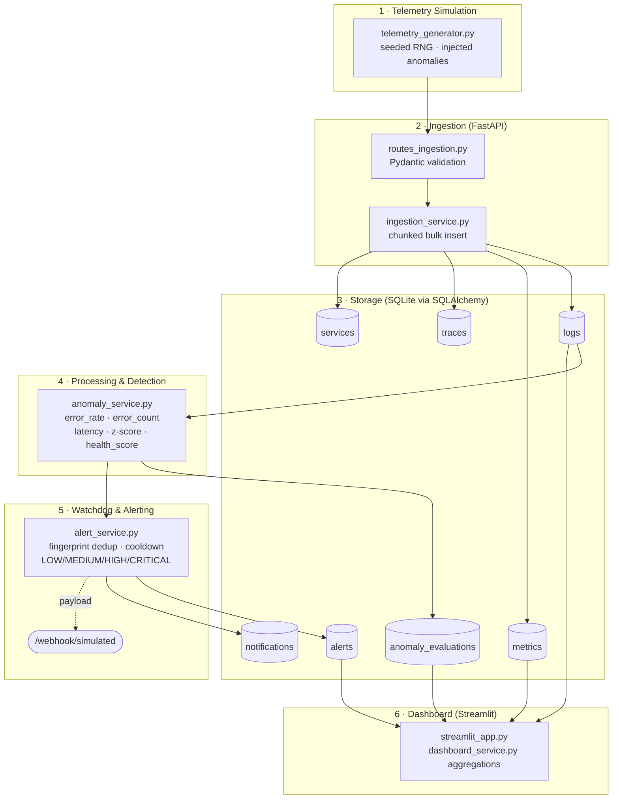
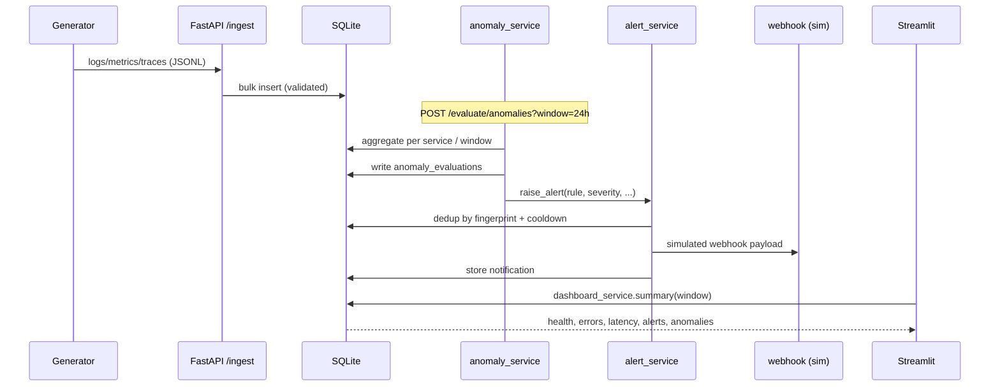
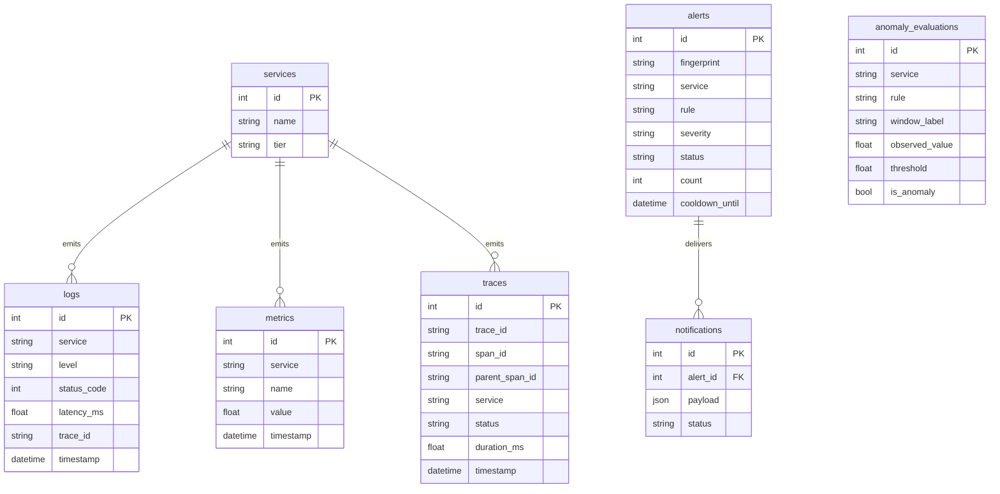

# Architecture

Andela Watch is a layered, API-first observability platform. Each layer is a
self-contained module so it can be reasoned about, tested, and later replaced by
its production-grade counterpart without touching the others.

## Layers

## Request → alert sequence

## Design decisions

- **Detection decoupled from ingestion.** Ingestion only validates + stores;
  detection is a separate pass. This mirrors a stream processor (Flink) reading
  asynchronously from a buffer (Kafka) — ingestion stays fast and cheap.
- **In-DB bucketing.** Time bucketing uses SQLite epoch division
  (`strftime('%s', ts) / bucket`), keeping aggregation in the database. Maps
  directly to Timescale `time_bucket()`. (Epoch math is UTC-consistent on both
  the SQL and Python sides — see `app/utils/time_utils.to_epoch`.)
- **Window-aware thresholds.** Error-count thresholds are per-hour and scaled by
  window length so a 24h view doesn't flag healthy high-traffic services.
- **Complementary rules.** No single rule is robust across all window sizes;
  `error_rate` (sharp on short windows), `error_spike` (z-score, window-robust),
  and `error_count` (rate-scaled volume) together cover the space.
- **Alert fatigue protection at the manager.** Dedup by `fingerprint =
  hash(service|rule|kind)` plus a cooldown window — equivalent to Alertmanager
  grouping + `repeat_interval`.

## Data model

