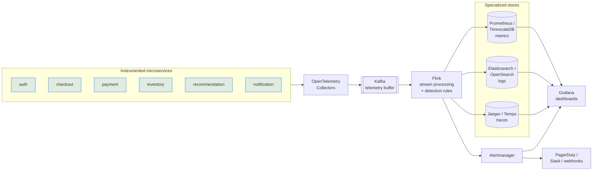

# Production Evolution

How this single-process, SQLite-backed MVP evolves into a horizontally scalable
enterprise observability platform. Every MVP module already isolates the concern
its production counterpart owns, so evolution is *replacement*, not *rewrite*.

## Target architecture

## Component-by-component mapping

| Concern | MVP (this repo) | Production | Why evolve |
|---|---|---|---|
| Instrumentation | `telemetry_generator.py` | **OpenTelemetry** SDKs + Collectors | Real signals from real services; vendor-neutral |
| Ingestion transport | FastAPI `/ingest/*` | **OTel Collector → Kafka** | Backpressure, durability, replay, fan-out, decoupling |
| Stream processing | `anomaly_service.py` (batch) | **Flink** (or Spark Structured Streaming) | Continuous, stateful windows; exactly-once; horizontal scale |
| Metrics store | `metrics` table | **Prometheus / TimescaleDB** | PromQL, downsampling, retention, `time_bucket()` |
| Logs store | `logs` table | **Elasticsearch / OpenSearch** | Full-text search, inverted indexes, ILM tiering |
| Traces store | `traces` table | **Jaeger / Tempo** | Span graphs, service maps, tail-based sampling |
| Alert management | `alert_service.py` (dedup+cooldown) | **Alertmanager / PagerDuty** | Grouping, inhibition, silences, escalation policies, on-call |
| Alert routing | `/webhook/simulated` + `notifications` | Real Slack / PagerDuty / webhooks | Actual paging, ack/resolve, runbooks |
| Dashboards | Streamlit | **Grafana** | Unified panels across all backends, RBAC, sharing |
| Storage engine | SQLite | Postgres / cloud-managed | Concurrency, HA, scale |

## Migration path (incremental, low-risk)

1. **Swap the database.** Set `WATCHDOG_DB_URL=postgresql+psycopg://...`. The
   ORM is unchanged; only the bucketing SQL (`strftime`) would move to Timescale
   `time_bucket()`. This alone gives concurrency + HA.
2. **Introduce OpenTelemetry.** Replace the generator with OTel SDKs in each
   service; point Collectors at the existing `/ingest/*` endpoints (OTLP).
3. **Insert Kafka.** Have Collectors publish to Kafka; the FastAPI ingestion
   becomes a thin consumer. Ingestion and detection are now fully decoupled.
4. **Port detection to Flink.** The rules in `anomaly_service.py` (rolling error
   rate, error count, latency vs. SLO, z-score spike, health score) become Flink
   windowed operators reading the Kafka topic continuously. State (baselines)
   lives in Flink's managed state instead of being recomputed per batch.
5. **Route to specialized stores.** Flink sinks metrics → Prometheus/Timescale,
   logs → Elasticsearch, traces → Tempo. Drop the monolithic tables.
6. **Hand alerting to Alertmanager.** Map `fingerprint` → Alertmanager grouping
   labels, `cooldown_until` → `repeat_interval`, severity → routing tree. Wire
   real receivers (PagerDuty/Slack).
7. **Move dashboards to Grafana.** Recreate the panels (health, error volume,
   latency, alerts, anomaly timeline) against the new datasources.

## Detection model evolution

The MVP uses transparent, debuggable statistics. Production-grade additions:

- **EWMA / Holt-Winters** for seasonality-aware baselines (traffic differs by
  hour-of-day and day-of-week).
- **Multivariate / correlation** detection (e.g., latency ↑ *and* error ↑
  together) to cut false positives.
- **Adaptive thresholds** learned per service instead of static config.
- **Tail-based trace sampling** to keep anomalous traces while dropping noise.
- **Alert flap suppression & dependency-aware inhibition** (don't page for
  `checkout` when its dependency `payment` is the root cause).

## Scaling characteristics

| Dimension | MVP ceiling | Production approach |
|---|---|---|
| Ingest throughput | ~10⁴–10⁵ rows/run (single process) | Kafka partitions + consumer groups |
| Detection latency | on-demand batch | continuous, sub-second windows in Flink |
| Retention | SQLite file | tiered (hot/warm/cold) per store with ILM |
| Concurrency | single writer | partitioned, replicated stores |
| Availability | single node | multi-AZ, replicated, auto-failover |
